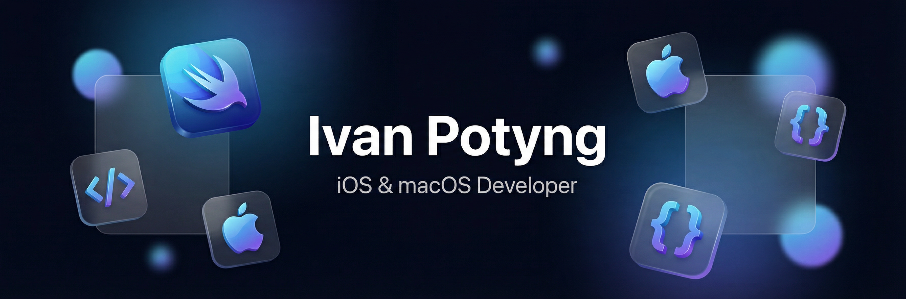

  

  <h1 align="center">Hi there, I'm Ivan Potyng</h1>
  <h3 align="center">iOS & macOS Developer | Creating seamless apps for Apple platforms</h3>

  

    
    
  

---

## About Me

I am an **iOS Developer** with commercial experience in building enterprise products in **FinTech**, **Construction Tech**, and **App Store** apps. I specialize in **Swift 6 strict concurrency**, **SwiftUI**, modular architecture (**SPM**), and building secure banking applications (3DS 2.0, SCA, Biometrics). I also build **backend platforms** with Python/Flask and set up **CI/CD pipelines** for automated deployment.

-  I’m currently working on **Real-time WebSocket systems & FinTech apps**
-  I’m open to collaborating on **iOS projects where architecture and code quality matter**
- Ask me about **SwiftUI, Swift Concurrency, Modular Architecture, CI/CD, Backend Development**

---

## Tech Stack & Skills

Building production iOS apps with emphasis on **architecture**, **concurrency**, **security**, and **real-time systems**.

  

**Languages:** Swift 5/6, Python  
**UI Frameworks:** SwiftUI, UIKit, MVVM-C, Coordinator, NavigationStack  
**Concurrency:** `async/await`, `Task`, `AsyncStream`, `actor`, `@MainActor`  
**Networking:** REST, JSON-RPC 2.0, WebSocket (reconnect, heartbeat)  
**Security:** 3DS 2.0, SCA, Keychain, Certificate Pinning, FaceID/TouchID  
**AR & Vision:** ARKit, LiDAR, RealityKit, Vision OCR, Core Image  
**Tools:** SPM, Fastlane, GitLab CI/CD, Docker, Docker Compose, Firebase, XCTest  
**Backend & DevOps:** Python, Flask, Telegram Bot API, Docker, GitLab CI/CD, SSH deployment, Nginx, SSL

---

## Selected Projects

### **RedRiver Apps — Enterprise Banking**
*Production banking apps for Moldova & Romania (20k+ users)*
- **Security**: Full implementation of 3DS 2.0, SCA, Biometrics, Keychain.
- **Architecture**: Modular (25+ SPM packages), MVVM-C, Hybrid Navigation.
- **Tech**: Swift 6, SwiftUI/UIKit, XCTest.

### **Real-time Tennis Application**
*Live session and scoring system*
- **Real-time**: WebSocket layer with exponential backoff & heartbeat.
- **Performance**: Request deduplication + throttling.
- **Tech**: JSON-RPC 2.0, AsyncStream, Actors.

### **PDF Scanner & Workflow**
*Document workflow app: scan, edit, sign, export*
- **Features**: VisionKit scanning, PencilKit signatures, PDF export.
- **Architecture**: MVVM + UseCases.

### **CourtPass-iOS**
*Authentication + catalog app*
- **Features**: Firebase Auth (Apple/Google), JSON-RPC 2.0 auth flow.
- **Tech**: Keychain token storage, DI Container.

### **QR Scanner & Generator**
*Scanner/generator with monetization flow*
- **Features**: AVFoundation scanning, QR generation + history.
- **Tech**: Apphud paywall integration, Swift 6 migration.

### **Backend Platform & CI/CD**
*Subscription management platform with automated deployment*
- **CI/CD**: GitLab CI/CD with automated test/production deployment via SSH.
- **Infrastructure**: Docker, Docker Compose, Nginx, SSL certificates (Let's Encrypt).
- **Backend**: Python Flask, Telegram Bot API, payment integrations (YooKassa, CryptoBot).
- **Deployment**: Automated rsync-based deployment, multi-environment support (test/production).

---

### Product Direction

- FinTech mobile scenarios
- Real-time reliability and network stability
- Scalable architecture for growing teams
- Performance-focused UX

 

  <i>Open to iOS projects where architecture and code quality matter.</i>

